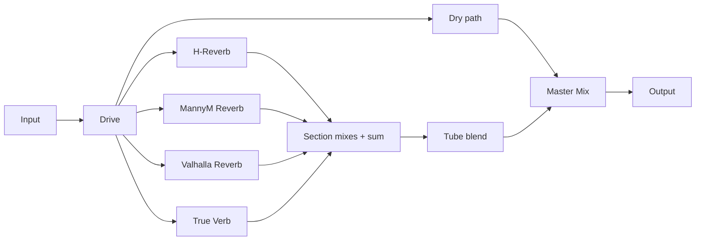

<div align="center">

# DIAMOND ROOM

**Reflect · Shape · Space**

Four parallel reverbs. Harmonic drive. Blended tube colour.

[](https://github.com/zenoxart/DiamondRoom-VST/actions/workflows/build.yml)


### Download Diamond Room

[**Windows - VST3**](https://github.com/zenoxart/DiamondRoom-VST/releases/download/latest-build/DiamondRoom-Windows-x64.zip) | [**macOS - VST3 + AU**](https://github.com/zenoxart/DiamondRoom-VST/releases/download/latest-build/DiamondRoom-macOS-universal.zip) | [**Linux - VST3**](https://github.com/zenoxart/DiamondRoom-VST/releases/download/latest-build/DiamondRoom-Linux-x64.tar.gz)

[Build details & checksum](https://github.com/zenoxart/DiamondRoom-VST/releases/tag/latest-build) · [Installation](#installation) · [Controls](#controls) · [Build from source](#development)

</div>


Diamond Room brings the `DiamondRoom.fst` FL Studio Patcher concept into a
self-contained JUCE/C++ plugin. Blend four reverb characters, push the entire
signal through Drive, and add tube compression to the reverb sum.

All audio processing is native. Waves, Valhalla and FL Studio are not required.
The reverbs are custom implementations inspired by the original chain, not the
original commercial plugins.

## The sound

| Shape | Space | Character |
| :--- | :--- | :--- |
| **Drive** adds even and odd harmonics, with darker highs as you push it. | **Four parallel reverbs** give you separate tone, time, character and level controls. | **Tube** blends the CleanVoice valve stage into the combined reverb signal. |
| Oversampled saturation with automatic level compensation. | Enable each section independently and blend with the master Mix. | Eight factory presets, undo/redo and a resizable crystal interface. |

## Installation

Download the archive for your platform, close your DAW, and extract it. Copy the
**complete plugin bundle** into the matching folder below, then restart your DAW
and rescan plugins. Keep every bundle's `Contents` directory intact.

| Platform | Download | Format & destination |
| :--- | :--- | :--- |
| **Windows x64** | [Download ZIP](https://github.com/zenoxart/DiamondRoom-VST/releases/download/latest-build/DiamondRoom-Windows-x64.zip) | VST3: `C:\Program Files\Common Files\VST3\` |
| **macOS 11+ - Intel & Apple Silicon** | [Download universal ZIP](https://github.com/zenoxart/DiamondRoom-VST/releases/download/latest-build/DiamondRoom-macOS-universal.zip) | VST3: `~/Library/Audio/Plug-Ins/VST3/` - AU: `~/Library/Audio/Plug-Ins/Components/` |
| **Linux x64 - glibc 2.35+** | [Download tar.gz](https://github.com/zenoxart/DiamondRoom-VST/releases/download/latest-build/DiamondRoom-Linux-x64.tar.gz) | VST3: `~/.vst3/` |

In FL Studio, use **Options > Manage plugins > Find installed plugins**, then add
**Diamond Room** to a mixer effect slot. In Logic Pro, use the **AU** version.
AU is a macOS-only format; Windows and Linux use VST3.

**macOS:** the bundles are ad-hoc signed but not Apple-notarised. macOS may block
a downloaded plugin until you approve it in **System Settings > Privacy & Security**.
Both CPU architectures are included in each bundle.

**Linux:** the release is built on Ubuntu 22.04. Use an x86_64 VST3 host with
glibc 2.35 or newer and the usual ALSA, X11 and font libraries. Extract the tar
archive with permissions preserved. Older distributions can build from source.

**Download channel:** development builds, updated only after every platform's
build and checks succeed on `main`. The [release page](https://github.com/zenoxart/DiamondRoom-VST/releases/tag/latest-build)
includes the source commit and SHA-256 checksums.

## Controls

| Section | Controls | Character |
| :--- | :--- | :--- |
| **Drive** | Drive · 0–10 | Saturation and progressively darker highs across the entire signal, including the dry path. |
| **H-Reverb** | Tone · Time · H-Mix | Hall-style tail with tonal shaping and early reflections. |
| **MannyM Reverb** | Distortion · Amount · Mix | Chamber character with output saturation and density control. |
| **Valhalla Reverb** | HighCut · Decay · Mix | Modulated hall with adjustable brightness and tail length. |
| **True Verb** | Distance · Roomsize · Mix | Room reflections, depth and air absorption. |
| **Tube** | Tube · 0–10 | Blend of the CleanVoice valve compressor on the reverb sum; 0 bypasses it, 10 applies it fully. |
| **Master** | Mix · 0–100% | Blend between the driven dry signal and the processed reverb sum. |

The glowing LEDs switch individual reverbs on and off. Section mix faders set
each reverb's contribution to the sum.



## Presets & workflow

Start with **Diamond Room**, **Vocal Plate**, **Tight Room**, **Cathedral**,
**Dark Chamber**, **Driven Wash**, **Crushed Verb** or **Subtle Air**.

- Click the preset name to load, save or delete a user preset. The arrows step through presets.
- Use undo and redo for parameter edits and preset changes. Each drag is one undo step.
- Choose a window size with the gear menu or resize from the corner. The size is saved with the session.
- User presets live in `%APPDATA%\DiamondRoom\Presets` as `.drpreset` files. An asterisk marks an edited preset.

## Automated builds

Every branch push and pull request triggers the [cross-platform build workflow](https://github.com/zenoxart/DiamondRoom-VST/actions/workflows/build.yml).
It checks out the pinned JUCE version, builds Windows and Linux VST3 bundles and
macOS universal VST3 + AU bundles, and runs the offline checks on each platform.
The macOS job also verifies both CPU slices, signs the bundles and runs Apple AU validation. Each successful build has a downloadable
artifact retained for 30 days.

Successful builds on `main` also update the **[public plugin downloads](https://github.com/zenoxart/DiamondRoom-VST/releases/tag/latest-build)**.
Pull requests and other branches never replace that download. The workflow can
also be started manually from the Actions tab.

## Development

<details>
<summary><strong>Build from source</strong></summary>

Requires CMake 3.22+, JUCE 8.0.4 and a C++17 compiler: Visual Studio 2022 on
Windows, Xcode on macOS, or GCC/Clang on Linux.

**Windows**

```powershell
git clone https://github.com/zenoxart/DiamondRoom-VST.git
cd DiamondRoom-VST
git clone --depth 1 --branch 8.0.4 https://github.com/juce-framework/JUCE.git JUCE
cmake -S . -B build -G "Visual Studio 17 2022" -A x64 -DDIAMONDROOM_COPY_PLUGIN_AFTER_BUILD=OFF
cmake --build build --config Release
```

**macOS** (after cloning the project and JUCE as above):

```bash
cmake -S . -B build -G Xcode '-DCMAKE_OSX_ARCHITECTURES=arm64;x86_64' -DCMAKE_OSX_DEPLOYMENT_TARGET=11.0 -DDIAMONDROOM_COPY_PLUGIN_AFTER_BUILD=OFF
cmake --build build --config Release --target DiamondRoom_VST3 DiamondRoom_AU
```

**Linux** (Ubuntu/Debian):

```bash
sudo apt-get install build-essential cmake ninja-build pkg-config libasound2-dev libjack-jackd2-dev libfreetype6-dev libfontconfig1-dev libx11-dev libxcomposite-dev libxcursor-dev libxext-dev libxinerama-dev libxrandr-dev libxrender-dev libgl1-mesa-dev xvfb xauth
cmake -S . -B build -G Ninja -DCMAKE_BUILD_TYPE=Release -DDIAMONDROOM_COPY_PLUGIN_AFTER_BUILD=OFF
cmake --build build --parallel 2 --target DiamondRoom_VST3
```

Build products are generated under `build/DiamondRoom_artefacts/Release/`.
Set `DIAMONDROOM_COPY_PLUGIN_AFTER_BUILD=ON` to copy the VST3 into the system plugin
folder after building. This is the default for local builds; CI disables it.

All artwork is embedded, including the complete crystal background. No external
image files or image-processing tools are needed to run or build the plugin.

</details>

<details>
<summary><strong>Run checks & refresh the screenshot</strong></summary>

```powershell
cmake -S . -B build -DDIAMONDROOM_BUILD_SCREENSHOT=ON
cmake --build build --config Release --target DiamondRoomShot
$tool = './build/DiamondRoomShot_artefacts/Release/DiamondRoomShot.exe'
& $tool --audio
& $tool --ui
& $tool --drive
& $tool --tube
& $tool --presets
& $tool --lifecycle
& $tool docs/images/diamond-room.png 1600
```

| Check | Coverage |
| :--- | :--- |
| `--audio` | Tail decay, headroom and finite output samples. |
| `--ui` | Fader drawing and mouse alignment at multiple sizes. |
| `--drive` | Harmonics, level compensation and high-frequency darkening. |
| `--tube` | Bypass, compression and blend behaviour. |
| `--presets` | Preset save/load, undo/redo and saved window size. |
| `--lifecycle` | 30 processor removals, 60 editor closures and five GUI shutdown cycles. |

These are offline checks. DAW-specific behaviour still needs host testing.
On macOS/Linux, omit `.exe` from the helper path; on headless Linux, run it
with `xvfb-run -a`. The preset check creates and removes a temporary preset in the user preset folder.

</details>

<details>
<summary><strong>Project structure</strong></summary>

```text
Source/       Processor, editor, parameters and presets
  dsp/        Drive, four reverbs and the CleanVoice valve stage
  gui/        Knobs, faders, panels and drawing helpers
Assets/       Embedded background and control artwork
Tools/        Offscreen renderer and offline checks
docs/images/ README screenshot
.github/      Windows, macOS and Linux build/download workflow
```

</details>

---

Project code: [MIT](LICENSE). JUCE and other dependencies retain their own licences.
